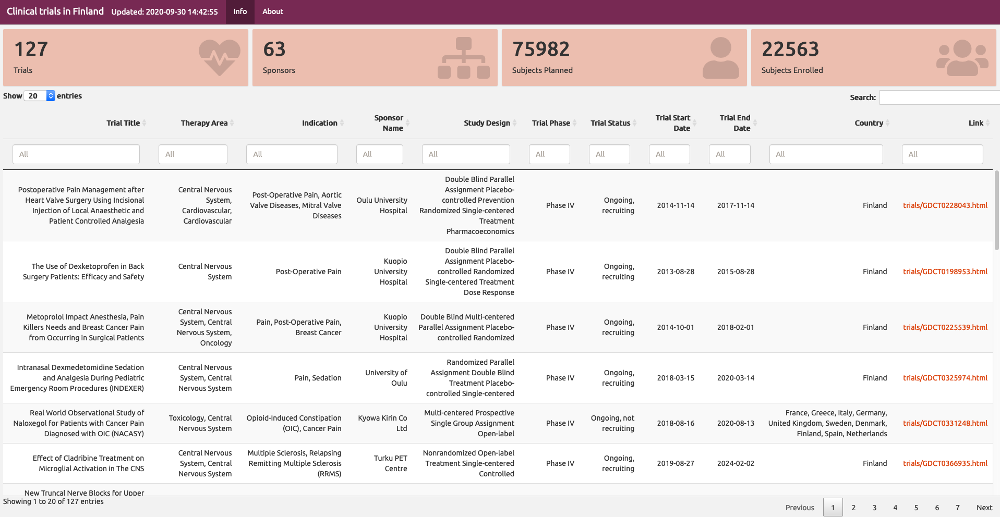

## Clinical trials database in webpages

This project parses clinical trials data from GlobalData.com and creates webpage database where user can explore what trials are going on. Use `run.R` to run this project and html files will be rendered to output-folder.

### Workflow

1. Download Excel files (single tab/advanced export) from GlobalData.com. Remember to check all the information columns to export!

2. Preformat file to CSV and save to `data/` folder with timestamp on filename. Example `2020-12-08_clinical_trials.csv`.

3. Source `run.R` file.

4. Take a cup of tea and enjoy while computer is doing some work.
